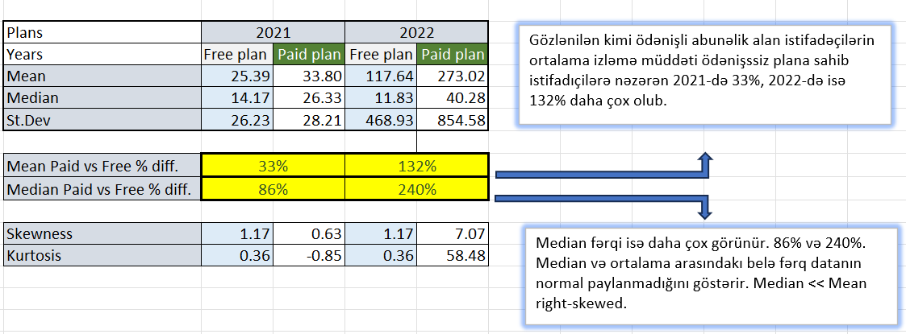
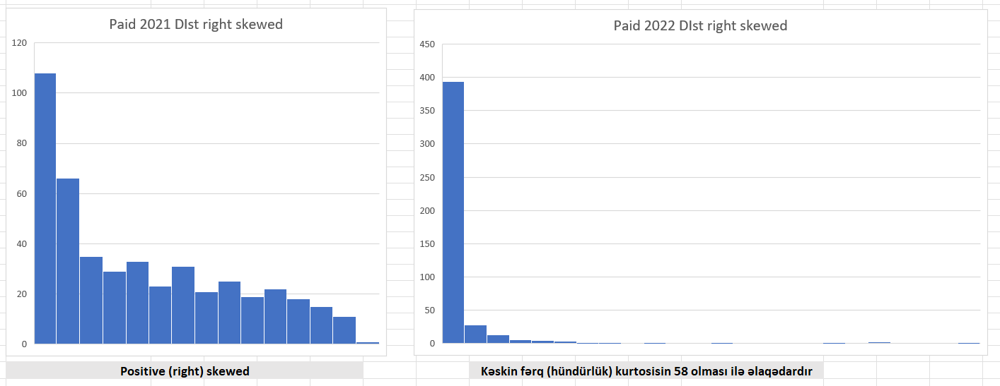

# 📊 Müştəri davranışı analizi (Excel ilə)

## 1. Ümumi Giriş
Bu analizdə online təlimlər verən bir saytın datasını təhlil etmişəm. Şirkət 2022ci ildə əksər yeniləmələr etmişdir və 2022-ci ilin yekununda 2021 və 2022 illər
arasındakı fərqi görmək istəyir. Əsas məqsəd yeniliklərin müşştəri davranışına necə təsir etməsini görmək, ödənişli və ödənişsiz xidmətlərdəki fərqi ölçmək həmçinin 
hər iki növ müştərilərin izləmə müddətini illər üzrə müqayisə etməkdir.

---

## 2. Statistik Göstəricilər: Mean, Median, St.Dev

İlkin olaraq hər iki tipli müştərilərin (paid/free) illər üzrə izləmə müddətləri üçün təsviri statistik ölçüləri hesablayırıq.
Mean Median Standard yayınma bu anlamda data haqqında ən çox məlumat verən statistik ölçümlərdir. Bizdə mean və median fərqi datamızın normal paylanmadığını,
yəni təklikdə ortalamaya güvənməyin bu datasetdə işə yaramayacağını göstərir.

---

## 3. Paylanma Forması: Skewness və Kurtosis

Skewness və kurtosis hesablamaları həmçinin paylanma qrafikinə nəzər yetirdikdə həm datanın saga meyilli olması (right skew)
həm də kurtosisin aşırı fərqliliyi (2ci qrafikdə kəskin fərqlənən uzun bar) bu datanın analizində bir neçə statistik göstəriciyə müraciəti vacib edir.

---

## 4. Yekun Sözlər

Bununla yanaşı 2022-ci ildə həm ödənişli həm də ödənişsiz abunəliklərdə ortalama izləmə müddətində kəskin artım var, median üçün isə eyni şey keçərli deyil. 
Hətta ödəişsiz abunəlikdə medianda 14.17-dən 11.83 qədər azalma müşahidə olunmuşdur. Bu isə 2022-ci ildə ortalamanı yüksəldən xususi qrup istifadəçilərin varlığını göstərir.
(Outliers)
Yekun analiz:
    Saytın 2022ci ildəki yenilikləri kifayət qədər yeni izləyicinin sayta üzv olmasını təşviq etmişdir. Lakin skevnes və kurtosis dəyərlərinə baxsaq görərik ki, 
    bu yeni istifadəçilər köhnə ekosistemdən tamamilə fərqli davranışlara sahibdirlər. Lakin ümumi olaraq ödənişli abunəçilərin median izləməsi təxminən 4dəfəyə yaxın 
    artması xidmət keyfiyyətinin yüksəlməsindən xəbər verir.
